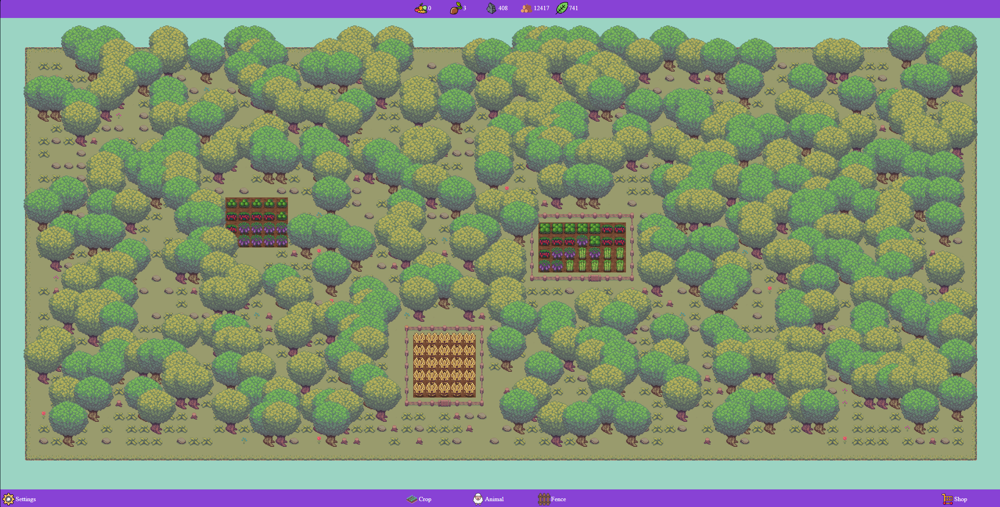

# FarmSimulator

This project is a game writed with html, css and javascript without framework or externale libraries. This game is a farm manager, player have to plant crops, build, manage animals, to recolt resources and make money. The main motivation for this project is to learn and increase skills in JavaScipt, HTML and CSS.

## Features

- Game settings to configure the major aspect of the game (map size, crops grow speed, ...)
- Display bar of resources and available elements, so player can select element (such as crops) in a drop down button who are placed in a bar
- Multiple resources and elements (tree, rock, crops, ...)
- Shop system to buy or sell animals, builds, seeds, crops...
- When elements are recolted animation is displayed with the owned resource
- Conditional harvesting and plant: Impossible to plant crops in a not plowed grass, to harvest a not fully grown crops, [...]
- Multiple crops with animation, who each of them have different time to grow, different much of resource recolted
- Map generated randomlly
- Animals with AI
- Builds

## Architecture and Pattern

MVC: without the model part because there is no external communication or server.
Class only: This project is mainly for learn my personal skills, so I decide to use classes only to explore the limitations and advantages of classes in JS.
ESM: Completely work with the modern ESM module management.

## Commands

| Command | Description 
| ------ | ------ |
| Left click | Select a element, or set it to the target square if already selected |
| Right click | Act on the target square to collect resources or change the ground | bulpotioneffect.admin |
| Mouse whell  | Change the rotation of an object if the object can rotate (such as barriers) |